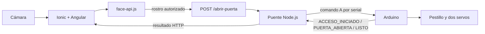

# AppFACIAL

Sistema de control de acceso que combina reconocimiento facial en Ionic/Angular,
un puente HTTP local en Node.js y una puerta controlada por Arduino con tres
servomotores.

> [!WARNING]
> Las imágenes de referencia contienen datos biométricos. No publiques este
> repositorio ni compartas esas imágenes sin autorización de las personas
> involucradas. El prototipo no sustituye un sistema profesional de seguridad.

## Estado actual

El proyecto permite:

- cargar los modelos de `face-api` desde `src/assets/models`;
- generar descriptores para `yo.jpeg` y `Sergio.jpeg`;
- analizar la cámara cada 5 segundos;
- mostrar en consola cada etapa del reconocimiento y la distancia obtenida;
- reconocer más de un usuario con un umbral de distancia de `0.5`;
- solicitar una sola apertura mientras el mismo rostro permanece en cámara;
- permitir otra apertura cuando el rostro sale del cuadro y vuelve a entrar;
- enviar la orden de acceso a un puente HTTP local;
- abrir, esperar 5 segundos, cerrar y volver a trabar la puerta;
- impedir órdenes duplicadas mientras el Arduino está ocupado;
- apagar la cámara y detener el ciclo al abandonar la pantalla.

La compilación Angular y la compilación Android de depuración han sido
verificadas correctamente.

## Arquitectura



## Tecnologías y versiones principales

- Angular 20
- Ionic 8
- Capacitor 8
- `@vladmandic/face-api` 1.7
- Node.js 22.12 o superior
- Express 5
- SerialPort 13
- Java 21 para Android
- Gradle 8.14.3 mediante el wrapper incluido
- Android SDK 36; mínimo Android SDK 24
- Arduino y la librería `Servo`

Capacitor 8 requiere Node.js 22 o superior. Se recomienda Node.js 22 LTS.

## Estructura importante

```text
Facial/
├─ src/
│  ├─ app/inicio/                  Reconocimiento facial y acceso
│  └─ assets/
│     ├─ images/                   Rostros de referencia
│     └─ models/                   Modelos locales de face-api
├─ puente-arduino/
│  ├─ index.js                     Servidor HTTP y conexión serial
│  ├─ package.json                 Dependencias exclusivas del puente
│  └─ control_puerta/
│     └─ control_puerta.ino        Firmware de Arduino
├─ android/                        Proyecto nativo de Capacitor
├─ capacitor.config.ts
├─ package.json
└─ README.md
```

## Requisitos

### Para probar solamente el reconocimiento facial

- Git
- Node.js 22.12 o superior
- npm
- Chrome, Edge u otro navegador con acceso a cámara
- una cámara web

### Para probar la puerta física

- todo lo anterior;
- Arduino Uno o una placa compatible con el sketch;
- Arduino IDE 2 o `arduino-cli`;
- librería `Servo`;
- cable USB;
- tres servomotores:
  - pestillo en pin 9;
  - puerta 1 en pin 10;
  - puerta 2 en pin 11.

> [!CAUTION]
> No alimentes tres servomotores directamente desde el pin de 5 V del Arduino.
> Usa una fuente externa adecuada para los servos y conecta su tierra (GND) con
> la tierra del Arduino. Calibra primero los motores sin carga mecánica.

### Para compilar Android

- Android Studio;
- Android SDK Platform 36;
- Java/JDK 21;
- variables `ANDROID_HOME` o un archivo local
  `android/local.properties` que apunte al SDK.

## 1. Clonar e instalar

```bash
git clone <URL_DEL_REPOSITORIO>
cd Facial
npm ci
npm ci --prefix puente-arduino
```

Hay dos instalaciones npm separadas:

- la raíz contiene Angular, Ionic, Capacitor y face-api;
- `puente-arduino` contiene Express, CORS y SerialPort.

No copies `node_modules` entre computadoras. Los dos `package-lock.json`
permiten reconstruir las mismas versiones con `npm ci`.

## 2. Preparar los rostros de referencia

Las imágenes actuales están en:

- `src/assets/images/yo.jpeg`;
- `src/assets/images/Sergio.jpeg`.

Cada imagen debe mostrar un rostro frontal, bien iluminado y sin otras personas.
Si se conservan los mismos nombres, basta con reemplazar los archivos. Para
agregar más personas también hay que añadir su imagen oculta en
`src/app/inicio/inicio.page.html` y su ID/etiqueta en
`crearDescriptoresReferencia()`, dentro de
`src/app/inicio/inicio.page.ts`.

Los siguientes archivos de modelos deben permanecer en
`src/assets/models`:

- SSD MobileNet v1;
- Face Landmark 68;
- Face Recognition.

La aplicación los sirve en tiempo de ejecución desde `/assets/models`.

## 3. Probar únicamente la IA en navegador

Desde la raíz:

```bash
npm start
```

Abrir:

```text
http://localhost:4200
```

Autoriza el acceso a la cámara y abre las herramientas del navegador con
`F12`. Los mensajes de diagnóstico incluyen:

- `Modelos cargados`;
- `Descriptores extraídos`;
- `Rostro detectado en cámara`;
- `Distancia de coincidencia`.

Sin el puente Arduino activo, el reconocimiento seguirá funcionando, pero una
coincidencia mostrará un error de hardware al intentar abrir la puerta.

Para publicar el servidor de desarrollo en la red local:

```bash
npm start -- --host 0.0.0.0
```

El acceso a cámara desde otro dispositivo puede ser bloqueado por el navegador
si la página se sirve por HTTP y no es `localhost`. Para una prueba en teléfono
se recomienda la app nativa de Capacitor.

## 4. Instalar y cargar el firmware Arduino

### Opción A: Arduino IDE

1. Abrir
   `puente-arduino/control_puerta/control_puerta.ino`.
2. Abrir **Herramientas > Administrar bibliotecas**.
3. Buscar e instalar **Servo** de Arduino.
4. Elegir la placa y el puerto correctos.
5. Presionar **Verificar** y luego **Subir**.
6. Cerrar el Monitor Serial antes de iniciar el puente Node.js.

### Opción B: arduino-cli

```bash
arduino-cli core update-index
arduino-cli core install arduino:avr
arduino-cli lib install Servo
arduino-cli board list
arduino-cli compile --fqbn arduino:avr:uno puente-arduino/control_puerta
arduino-cli upload -p COM3 --fqbn arduino:avr:uno puente-arduino/control_puerta
```

Cambia `COM3` por el puerto mostrado por `arduino-cli board list`. En Linux
suele ser `/dev/ttyACM0`; en macOS suele comenzar con
`/dev/cu.usbmodem`.

El sketch inicia a 9600 baudios y debe enviar:

```text
LISTO
```

### Calibración

Editar estas constantes antes de conectar la puerta real:

```cpp
const int cerraduraTrabada = 0;
const int cerraduraDestrabada = 90;
const int puertaCerrada = 0;
const int puertaAbierta = 180;
const bool puerta2Invertida = false;
```

Si el segundo servo está instalado como espejo, cambiar
`puerta2Invertida` a `true`. Primero probar con los servos desacoplados para
evitar forzar el mecanismo.

## 5. Ejecutar el puente Arduino

El puerto predeterminado es `COM3`, los baudios son `9600` y el servidor HTTP
escucha en el puerto `5000`.

### Windows PowerShell

```powershell
$env:ARDUINO_PORT = 'COM3'
$env:PORT = '5000'
npm start --prefix puente-arduino
```

### Linux o macOS

```bash
ARDUINO_PORT=/dev/ttyACM0 PORT=5000 npm start --prefix puente-arduino
```

Si el frontend se abre desde otra computadora o dirección de red, agregar su
origen exacto a CORS.

PowerShell:

```powershell
$env:ALLOWED_ORIGINS = 'http://192.168.1.50:4200'
npm start --prefix puente-arduino
```

Bash:

```bash
ALLOWED_ORIGINS=http://192.168.1.50:4200 npm start --prefix puente-arduino
```

Se pueden separar varios orígenes con comas.

Al iniciar correctamente deben aparecer mensajes equivalentes a:

```text
[Puente Red] Escuchando órdenes en http://localhost:5000
[Hardware] Conectado al Arduino en COM3 a 9600 baudios
[Arduino] LISTO
```

### Probar el puente manualmente

Estado:

```bash
curl http://localhost:5000/estado-puerta
```

Apertura:

```bash
curl -X POST http://localhost:5000/abrir-puerta
```

La petición de apertura permanece pendiente hasta que Arduino termina toda la
secuencia y responde `LISTO`.

## 6. Ejecutar el sistema completo en PC

Usar dos terminales.

Terminal 1:

```powershell
$env:ARDUINO_PORT = COM3
npm start --prefix puente-arduino
```

Terminal 2:

```bash
npm start
```

Después abrir `http://localhost:4200`. Cuando un rostro autorizado sea
detectado, el frontend enviará una sola orden al puente. Para repetir el acceso:

1. esperar a que la puerta cierre y el puente reciba `LISTO`;
2. retirar el rostro del encuadre;
3. esperar un ciclo de escaneo;
4. volver a entrar en el encuadre.

## 7. Compilar y probar Android

Instalar primero las dependencias y generar la aplicación web:

```bash
npm ci
npm run build
npx cap sync android
```

`cap sync` regenera, entre otros archivos,
`android/capacitor-cordova-android-plugins/cordova.variables.gradle`. No se
debe crear ese archivo manualmente.

### Configurar el Android SDK

Android Studio suele crear `android/local.properties`. Si no existe, crear el
archivo localmente, sin subirlo a Git:

```properties
sdk.dir=C:/Users/USUARIO/AppData/Local/Android/Sdk
```

En Linux o macOS usa la ruta real de tu SDK.

### Compilar el APK desde terminal

Windows:

```powershell
cd android
.\gradlew.bat assembleDebug
cd ..
```

Linux o macOS:

```bash
cd android
./gradlew assembleDebug
cd ..
```

El APK se genera en:

```text
android/app/build/outputs/apk/debug/app-debug.apk
```

También se puede abrir el proyecto nativo:

```bash
npx cap open android
```

### Conectar Android con el puente

El teléfono y la computadora que ejecuta `puente-arduino` deben estar en la
misma red. Cambiar en `src/app/inicio/inicio.page.ts`:

```ts
private readonly ipPuenteEnDispositivo = '192.168.120.49';
```

por la IPv4 local de la computadora. Después volver a ejecutar:

```bash
npm run build
npx cap sync android
```

También puede ser necesario permitir el puerto TCP 5000 en el firewall.

> [!IMPORTANT]
> El puente actual utiliza HTTP local. El manifiesto Android todavía no habilita
> explícitamente tráfico sin cifrar. Para una prueba nativa de desarrollo puede
> ser necesario agregar temporalmente
> `android:usesCleartextTraffic="true"` al elemento `<application>` de
> `android/app/src/main/AndroidManifest.xml`. No se recomienda mantener HTTP
> sin cifrar para producción; allí debe utilizarse HTTPS y autenticación.

## Protocolo entre Node.js y Arduino

El puente envía un solo carácter:

| Dirección | Mensaje | Significado |
| --- | --- | --- |
| Node → Arduino | `A` | Iniciar acceso |
| Arduino → Node | `ACCESO_INICIADO` | Secuencia aceptada |
| Arduino → Node | `PUERTA_ABIERTA` | Puerta abierta |
| Arduino → Node | `OCUPADO` | Ya existe una secuencia |
| Arduino → Node | `LISTO` | Puerta cerrada y asegurada |
| Arduino → Node | `COMANDO_INVALIDO:x` | Orden desconocida |

El firmware usa una máquina de estados basada en `millis()`; no bloquea el
puerto serial durante todo el movimiento.

## Endpoints del puente

### `GET /estado-puerta`

Ejemplo:

```json
{
  "conectado": true,
  "ocupado": false,
  "listo": true
}
```

### `POST /abrir-puerta`

Respuestas principales:

- `200`: la secuencia terminó correctamente;
- `409`: la puerta ya está ocupada;
- `503`: Arduino no está conectado o todavía no envió `LISTO`;
- `504`: Arduino no confirmó el final dentro de 20 segundos.

## Comandos útiles

```bash
# Desarrollo Angular
npm start

# Compilación web
npm run build

# Linter
npm run lint

# Pruebas unitarias
npm test

# Puente Arduino
npm start --prefix puente-arduino

# Sincronizar cambios web con Android
npx cap sync android
```

## Solución de problemas

### `cannot open source file Servo.h`

Instalar la librería desde el Administrador de bibliotecas de Arduino IDE o:

```bash
arduino-cli lib install Servo
```

El subrayado de VS Code puede ser solo IntelliSense. La comprobación definitiva
es compilar desde Arduino IDE o `arduino-cli`.

### `Opening COM3: Access denied`

El puerto serial solo puede ser usado por un proceso a la vez.

1. cerrar el Monitor Serial de Arduino IDE;
2. detener otras instancias de `node index.js`;
3. desconectar y reconectar Arduino si fuera necesario;
4. iniciar nuevamente el puente.

Para cargar un sketch, detener primero el puente Node.js. Después de subirlo,
cerrar el Monitor Serial y volver a iniciar el puente.

### Arduino conecta, pero el puente no acepta aperturas

El puente espera el mensaje `LISTO`. Confirmar que:

- el sketch correcto esté cargado;
- ambos lados utilicen 9600 baudios;
- Arduino haya terminado de reiniciarse;
- el Monitor Serial no esté ocupando el puerto.

### Error 404 al cargar modelos

- ejecutar el comando desde la raíz del proyecto;
- comprobar que exista `src/assets/models`;
- abrir la aplicación mediante `npm start`, no directamente como archivo;
- revisar la pestaña **Network** del navegador.

### No se extrae un descriptor de referencia

Reemplazar la imagen por una fotografía frontal, nítida y bien iluminada. Cada
archivo de referencia debe contener exactamente un rostro claramente visible.

### Falta `cordova.variables.gradle`

```bash
npm ci
npm run build
npx cap sync android
```

No editar manualmente `android/app/capacitor.build.gradle`, porque Capacitor lo
regenera.

### `SDK location not found`

Configurar `ANDROID_HOME` o crear `android/local.properties` con
`sdk.dir`. Este archivo es específico de cada computadora y está ignorado por
Git.

### Android no alcanza el puente

- comprobar que PC y teléfono estén en la misma red;
- usar la IPv4 de la PC, no `localhost`;
- comprobar `http://IP_DE_LA_PC:5000/estado-puerta`;
- permitir el puerto 5000 en el firewall;
- revisar `ALLOWED_ORIGINS`;
- revisar la configuración de tráfico HTTP local descrita anteriormente.

## Cambios acumulados en esta versión

- corregida la carga asíncrona de modelos antes de encender la cámara;
- sincronizados los IDs de imágenes y video entre HTML y TypeScript;
- agregados registros de diagnóstico para modelos, descriptores, detecciones y
  distancias;
- movido el escaneo fuera de Angular `NgZone`;
- agregada limpieza del intervalo y de las pistas de cámara;
- agregado `muted` al video para compatibilidad con autoplay;
- evitadas inferencias y órdenes de apertura simultáneas;
- permitida una nueva apertura después de retirar y volver a mostrar el rostro;
- agregado puente HTTP con CORS, estado de hardware y timeout;
- agregado protocolo serial con confirmación de secuencia completa;
- convertido el firmware a una máquina de estados no bloqueante;
- agregado cierre automático y control de dos servos de puerta;
- movido el sketch a `puente-arduino/control_puerta`;
- separadas las dependencias Node del puente respecto a la app Ionic;
- agregado `package-lock.json` propio para el puente;
- ampliado `.gitignore` para dependencias, compilaciones, entornos y llaves;
- sincronizado y compilado correctamente el proyecto Android.

## Seguridad y límites del prototipo

- CORS no es autenticación.
- El endpoint de apertura no tiene usuarios, tokens ni firma de solicitudes.
- El puente debe ejecutarse únicamente en una red local confiable.
- El umbral facial `0.5` debe validarse con pruebas reales.
- Una sola fotografía por persona es insuficiente para un sistema de seguridad
  de producción.
- No existe detección de vida; una fotografía o pantalla podría engañar al
  modelo.
- Las imágenes faciales no deben almacenarse en un repositorio público.
- Para producción se requiere HTTPS, autenticación, auditoría y protección
  contra repetición de solicitudes.
